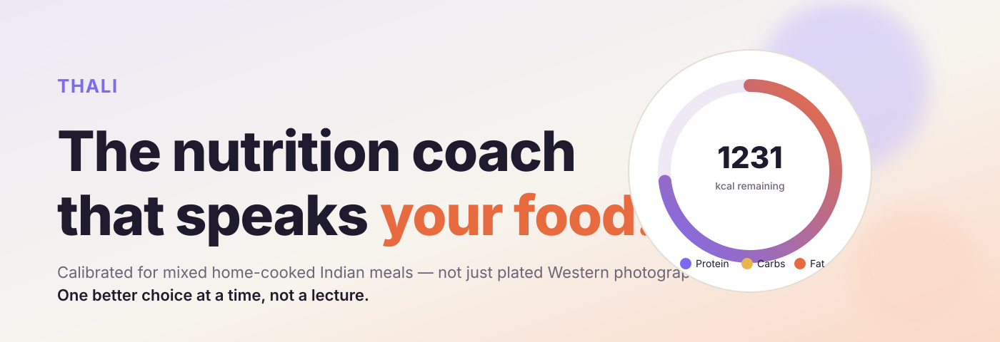
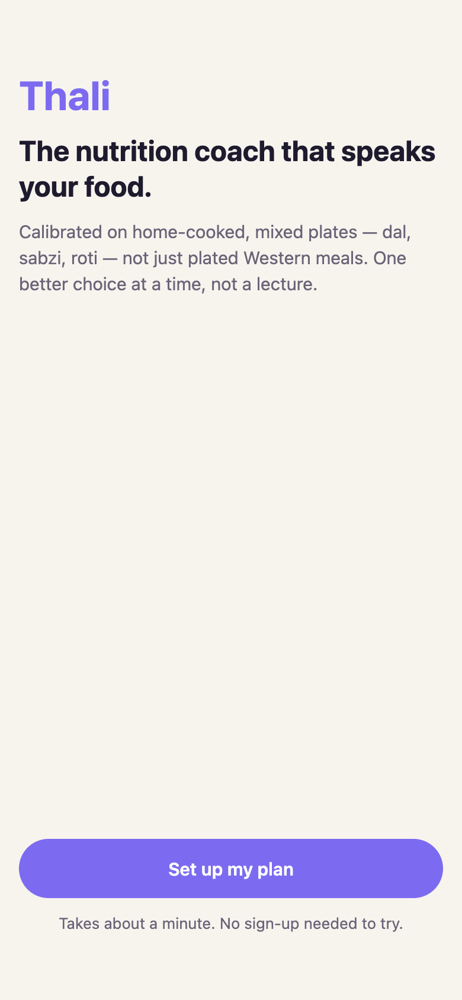
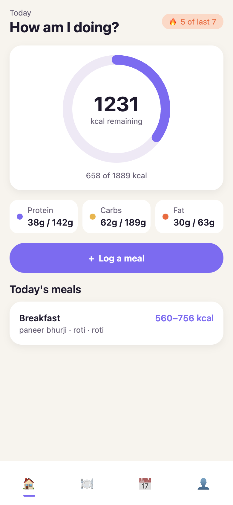
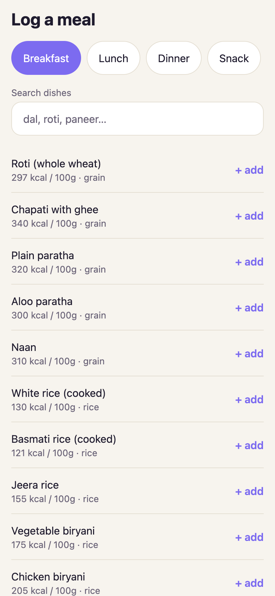
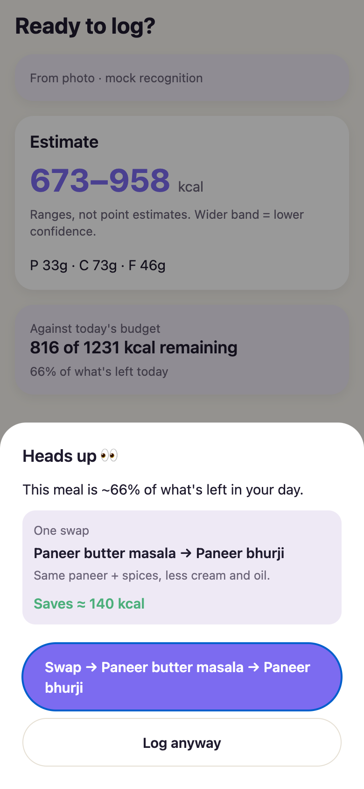
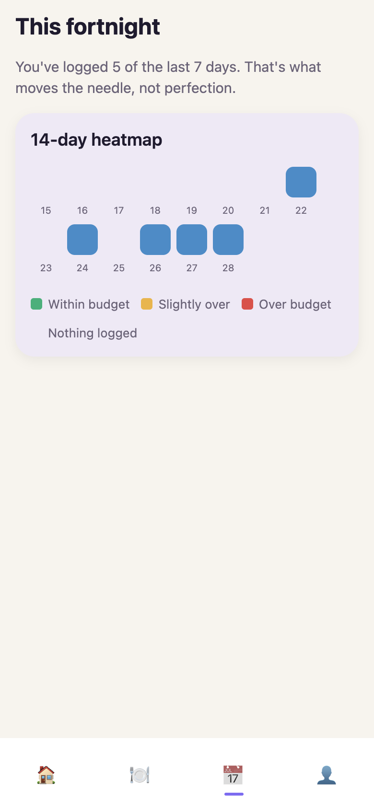

<p align="center">
  
</p>

<h1 align="center">Thali</h1>

<p align="center">
  <strong>AI nutrition coach calibrated for mixed home-cooked Indian meals.</strong><br>
  Ranges, not fake precision. One better choice at a time, not a lecture.
</p>

<p align="center">
  <a href="https://thali-ai.vercel.app"></a>
  <a href="https://github.com/pmdojo/Thali--AI-calorie-meal-Tracker"></a>
</p>

<p align="center">
  
  
  
  
</p>

<p align="center">
  <a href="https://thali-ai.vercel.app"><b>▶  Try the live demo →</b></a>
</p>

---

## The wedge — why not just use Cal AI?

Photo-based calorie logging is commoditized. Cal AI alone crossed 8.3M downloads on a single feature: **point, shoot, get a number**. But the number is frequently wrong on exactly the meals hardest to log manually — mixed, home-cooked Indian dishes — and even when it's right, **nothing happens next**. The user still has to decide, unaided, whether to eat the roti or skip it.

Two distinct problems are being sold as one app:

1. *"What did I just eat?"* — every incumbent solves this.
2. *"What should I do about it?"* — almost none solve this.

Thali solves #2 for a specific segment.

|                                | Thali                                  | Cal AI / MyFitnessPal                |
| ------------------------------ | -------------------------------------- | ------------------------------------ |
| **Calibrated for Indian food** | ~35-dish reference table, gram-weighted per portion | Global DB — guesses on thali plates |
| **Estimate honesty**           | Range with confidence band             | Point estimate, false precision     |
| **After the number**           | Pre-log flag + one concrete swap        | Passive display, no next action     |
| **Trust model**                | LLM only identifies dishes; math is deterministic | LLM emits calories directly        |

---

## Screenshots

<table>
  <tr>
    <td width="20%" align="center"><br><sub><b>Welcome</b></sub></td>
    <td width="20%" align="center"><br><sub><b>Home dashboard</b></sub></td>
    <td width="20%" align="center"><br><sub><b>Log a meal</b></sub></td>
    <td width="20%" align="center"><br><sub><b>The wedge: pre-log flag + swap</b></sub></td>
    <td width="20%" align="center"><br><sub><b>Weekly heatmap</b></sub></td>
  </tr>
</table>

The flag fires when a meal is projected to eat more than **40% of the remaining daily budget**, or when overall recognition confidence is below **0.7**. It always offers exactly two choices (Hick's Law): *"log anyway"* or *"see one better option"* — never a menu that stalls the decision at the point it matters most.

---

## Features

### Shipped (v1)
- **Deterministic goal engine** — Mifflin-St Jeor BMR + activity multiplier + sustainable 0.5%/week loss/gain rate → daily kcal budget + macro split with a 1.6 g/kg protein floor. Fully unit-tested.
- **~35-dish Indian reference table** — per-portion gram weights (small/medium/large) for roti, dal tadka, paneer butter masala, chana masala, dosa, poha, biryani, etc. Versioned as data, expandable without redeploy.
- **Photo capture** — `expo-camera` with gallery-picker fallback; permission gate with graceful UX.
- **Mock recognition mode** — the flow runs end-to-end without any API keys, so the demo is free forever.
- **Live recognition** — when Supabase + Anthropic keys are set, images route to a `analyze-meal` Edge Function that calls Claude vision with a tool-use schema (`emit_recognition`) — the LLM only emits dish identities and portions; **calorie math is done server-side against the reference table**.
- **Pre-log flag** — the wedge. Meal > 40% of remaining budget → Hick's-Law two-choice modal with one concrete swap.
- **Alternative-suggestion table** — rule-based (paneer butter → paneer bhurji, dal makhani → dal tadka, aloo paratha → roti, etc.). LLM used only for phrasing, never for the decision.
- **Ledger** — meals grouped by breakfast / lunch / dinner / snack, each with kcal range + component list + swap indicator.
- **Weekly calendar heatmap** — 🟢 within budget · 🟡 slightly over · 🔴 over. Playful "smart streak" copy ("5 of last 7 days" — not shaming).
- **Landing page** with waitlist form + Supabase-backed capture endpoint.

### Not in v1 — deliberately
No global food database. No barcode scanner. No chat coach. No micronutrients. No streak shaming. Narrow scope is what lets the accuracy claim stand up.

---

## Tech stack

| Layer         | Choice                                                 | Why                                                                 |
| ------------- | ------------------------------------------------------ | ------------------------------------------------------------------- |
| Mobile        | **Expo SDK 51** (React Native, expo-router)             | Native camera; single codebase for iOS/Android; web export for portfolio demos |
| State         | **Zustand + AsyncStorage persist**                     | 1 KB of code, no context boilerplate, easy to seed for testing      |
| Recognition   | **Claude Sonnet 5** vision via Anthropic Messages API   | Tool-use forces structured output; nutrition math never trusts free text |
| Validation    | **Zod**                                                | Every LLM response is parsed at the boundary                        |
| Backend       | **Supabase** (Postgres + Auth + RLS + Edge Functions)  | RLS enforces self-only data on day one; Edge Function keeps the API key server-side |
| Landing       | **Next.js 14** (App Router)                            | Fast static hero + waitlist API route                               |
| Design tokens | Shared `packages/ui-tokens`                            | Colors + spacing + type shared by mobile and web — one source of truth |
| Deploy        | **Vercel** (mobile RN Web export)                      | Free tier, auto-deploy on `git push`                                |
| Tests         | **Vitest**                                             | 17 tests, all deterministic; run in ~400 ms                         |

---

## Architecture

```
┌─────────────────────────────────────────────────────────────────────────┐
│                       apps/mobile  (Expo + expo-router)                 │
│                                                                         │
│   Onboarding ─► GoalEngine ─► Dashboard ◄─── Ledger ── Weekly heatmap   │
│                                   │                                     │
│                                   ▼                                     │
│                        📸 Camera / Gallery ─► base64                    │
│                                   │                                     │
└───────────────────────────────────┼─────────────────────────────────────┘
                                    │
                                    ▼
                    ┌──────────────────────────────┐
                    │  supabase/functions          │
                    │  analyze-meal (Deno Edge)    │
                    │                              │
                    │  Claude vision + tool-use    │
                    │  → { name, portion, conf }[] │
                    └──────────────┬───────────────┘
                                   │
                                   ▼
                    ┌──────────────────────────────┐
                    │  packages/shared             │
                    │                              │
                    │  resolveComponents()         │
                    │    ↳ findDishByName          │
                    │  estimateMeal()              │
                    │    ↳ gramsFor · macros       │
                    │  evaluateFlag()              │
                    │  suggestAlternative()        │
                    └──────────────┬───────────────┘
                                   │
                                   ▼
                            📱 Review + Flag  ─►  Ledger
                                                    │
                                                    ▼
                                  Supabase Postgres (RLS on)
                                  profiles · meal_logs · dish_reference
```

**Key architectural decision:** the LLM is a swappable component, not a hard dependency. The Edge Function returns `{ name, portion, confidence }[]` only — every kilocalorie number is computed client-side against a versioned dish reference table. This means:

1. Recognition accuracy is a **data** problem (grow the reference table), not a prompt problem.
2. Cost per meal is bounded: ~2 K tokens in, ~150 out. On Sonnet 5 that's about **$0.01 per photo**.
3. The app runs identically with a mock recogniser — no vendor lock-in, no dead demo when the API rate-limits.

---

## Installation

**Prerequisites**

- Node 20+ (Node 24 also works)
- npm 10+
- iOS: Xcode 15+ (for `expo run:ios` on a real simulator). Not needed for web build.
- Android: Android Studio + a virtual device (optional).

**1. Clone and install**

```bash
git clone https://github.com/pmdojo/Thali--AI-calorie-meal-Tracker.git thali
cd thali
npm install
```

**2. Run the deterministic core (no API keys needed)**

```bash
npm test                      # 17/17 unit tests, ~400ms
cd apps/mobile && npm start   # Expo dev server — press i for iOS, w for web
```

Everything except live vision recognition works out of the box in mock mode. This is the "portfolio demo" state.

**3. (Optional) Wire real vision recognition**

```bash
cp .env.example .env
# Fill in EXPO_PUBLIC_SUPABASE_URL, EXPO_PUBLIC_SUPABASE_ANON_KEY, ANTHROPIC_API_KEY

# Create a Supabase project at supabase.com (free tier is fine), then:
brew install supabase/tap/supabase
supabase link --project-ref <your-project-ref>
supabase db push                                              # applies migrations
psql "$SUPABASE_DB_URL" -f supabase/seed/dish_reference_v1.sql   # seeds ~35 dishes
supabase functions deploy analyze-meal
supabase secrets set ANTHROPIC_API_KEY=sk-ant-...
```

Restart the Expo dev server — the Photo tab will now hit real Claude vision instead of the mock plate.

**4. Deploy your own copy**

```bash
npm i -g vercel
cd thali && vercel                    # first deploy
vercel --prod                         # subsequent deploys
```

`vercel.json` at the repo root handles the workspace-hoisted `npm install` and the `expo export --platform web`.

---

## Roadmap

### v1.1 — accuracy loop *(next)*
- **Correction feedback** — persist `was_corrected` + `corrected_kcal` to Supabase, surface per-dish correction rate for calibration table updates.
- **User dish additions** — let users add a custom dish that gets promoted to the reference table once enough users log it.
- **Expand reference table** to ~100 dishes (regional coverage: south-Indian tiffin, Bengali fish curries, Punjabi tandoor).

### v1.2 — habits and momentum
- **Smart meal reminders** — "It's been 6 hours since breakfast" instead of "Log your lunch."
- **Achievements** — sparingly used; only when they represent real change (first week of consistent protein floor, first 30 days).
- **Weight tracking + BMI trend** with a gentle "cluster around your target" chart, not a linear death march.

### v1.3 — depth
- **Restaurant mode** — recognizes a takeout plate context and widens the confidence band automatically.
- **Voice logging** — "I had two rotis and dal for lunch" → parsed into components.
- **Chat coach** — a stateful conversation grounded in the user's actual last 7 days of logs, not a generic wellness bot.

### v2 — beyond Indian meals
- **Cuisine expansion** to Mexican, Middle Eastern, Southeast Asian — same architecture, new reference tables.
- **Barcode scanner** for packaged foods (only after core loop metrics are stable).
- **Household mode** — two people, one plate photograph, split by portion.

### Explicit non-goals *(any version)*
- Micronutrient tracking (visual estimation doesn't support the precision).
- Social feed / streak shaming.
- General-purpose global food database competitor — the whole thesis rests on staying narrow.

---

## Repo layout

```
thali/
├── apps/
│   ├── mobile/     # Expo — the product
│   └── web/        # Next.js landing page + waitlist
├── packages/
│   ├── shared/     # goal engine, dish table, alt rules, Zod schemas — the deterministic core
│   └── ui-tokens/  # colors, spacing, type — shared design tokens
├── supabase/
│   ├── migrations/     # 0001_init.sql — tables + RLS
│   ├── seed/           # dish_reference seed
│   └── functions/      # analyze-meal Edge Function
├── docs/
│   ├── hero.svg
│   └── screenshots/
└── vercel.json     # workspace-aware build config
```

---

## License

MIT. Fork it, remix it, calibrate it for the cuisine you grew up eating.

---

<p align="center">
  <sub>Built by <a href="https://github.com/pmdojo">Rajashri Hapse</a>. Product design + engineering.</sub>
</p>
